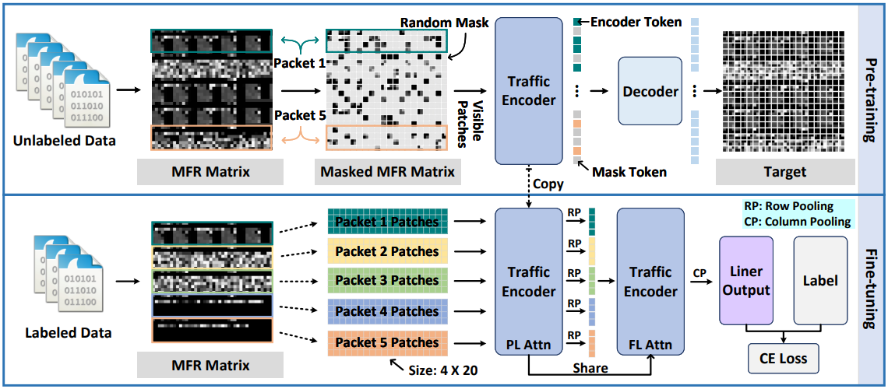

# YaTC

This repository contains the code for the paper:
<br>
***Yet Another Traffic Classifier: A Masked Autoencoder Based Traffic Transformer with Multi-Level Flow Representation***
<br>
In Thirty-Seventh AAAI Conference on Artificial Intelligence (AAAI 2023).

Besides, the extended version of our work has been submitted to IEEE/ACM Transactions on Networking for consideration for publication.


## Overview



The training strategy of YaTC is divided into two stages: pre-training stage and fine-tuning stage.

## The Pre-trained Model

```
Path: ./output_dir/pretrained-model.pth
```

## Datasets Information

```
Path: ./data
```

### number of class

- ISCXVPN2016_MFR: 7
- ISCXTor2016_MFR: 8
- USTC-TFC2016_MFR: 20
- CICIoT2022_MFR: 10

## Code Information

- data_process.py: process traffic pcap files of flows to MFR matires
- models_YaTC: the code of the classifier model
- pre-train.py: the code of pre-training stage
- fine-tune.py: the code of fine-tuning stage

## Pre-training

```
python pre-train.py --batch_size 128 --blr 1e-3 --steps 150000 --mask_ratio 0.9
```

## Fine-tuning

```
python fine-tune.py --blr 2e-3 --epochs 200 --data_path ./data/ISCXVPN2016_MFR --nb_classes 7
```

## Contact-Info

Link to our laboratory: [SJTU-NSSL](https://github.com/NSSL-SJTU "SJTU-NSSL")

[Ruijie Zhao](https://github.com/iZRJ)
<br>
Email: ruijiezhao@sjtu.edu.cn

[Mingwei Zhan](https://github.com/zmw1216)
<br>
Email: mw.zhan@sjtu.edu.cn

## Reference

R. Zhao, M. Zhan, X. Deng, Y. Wang, Y. Wang, G. Gui, and Z. Xue, ``Yet Another Traffic Classifier: A Masked Autoencoder Based Traffic Transformer with Multi-Level Flow Representation,'' in AAAI Conference on Artificial Intelligence (AAAI'23), Washington, United States, Feb. 7--14, 2023, pp. 1--8.

The extended version of our work has been submitted to IEEE/ACM Transactions on Networking for consideration for publication.
